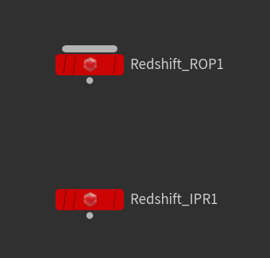

# Houdini Python
Houdini tools and operations
#
### Shelf Tools Setup
* New Shelf Location
    * Saved to _Documents\houdini18.0\toolbar_
* New Tool Checklist
    * Options
        * Complete <code>Name</code> and <code>Label</code>
        * Search for <code>Icon</code> from other existing tools
    * Script
        * Populate field with script and comments
        * These are located within this repo
    * Context
        * Select applicable network contexts, such as <code>OBJ</code> and/or <code>SOP</code>, or others as applicable.
#
### Template File
* Documented within the 123.py file and intended to expedite the process of starting a working file with prebuilt nodes and networks.
* The following are some screencaps of networks with the prebuilt nodes:

*Object Network*

      
        
*Material Network*

*Out Network*

